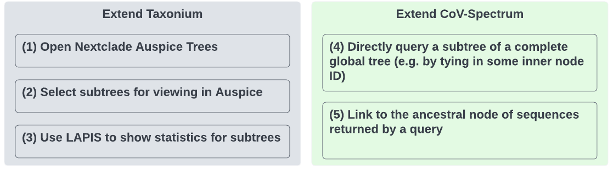

# Team Project Name

List of participants and affiliations:
- Chaoran Chen, ETH Zurich, Basel Switzerland (Team Leader)
- Adrian Lison, ETH Zurich, Basel Switzerland
- Auguste Rimaite, ETH Zurich, Basel Switzerland
- Jennifer Chang, Fred Hutchinson Cancer Research Center
- Theo Sanderson, Francis Crick Institute
- Alex Kramer, UC Santa Cruz

## Project Goals



## Approach

**Extend Taxonium**


[Edit Lucid Chart](https://lucid.app/lucidchart/ad401301-0705-4431-a350-6fe3b12c4da8/edit?viewport_loc=8%2C-59%2C1770%2C994%2C0_0&invitationId=inv_cd51a3eb-e93d-4f94-b043-d68103722861#)


**Extend CoV-Spectrum**


[Link to the CoV-Spectrum instance during the codeathon](https://cov-spectrum-develop-git-ncbi-codeathon-2022-cov-spectrum.vercel.app/)

**New Cladeness API**

```
curl --header "Content-Type: application/json" \
  --request POST \
  --data '["ON875035", "ON861689"]' \
  https://cladeness.cov-spectrum.org/mrca
```

## Results

### Taxonium / Nextstrain integration
#### 1. Import Nextstrain JSON trees
Taxonium can now load tree files in the Nextstrain JSON (v2) [format](https://github.com/nextstrain/augur/blob/master/augur/data/schema-export-v2.json).

Example Nextstrain [JSON file](https://ns-proxy.vercel.app/api/charon/getDataset?prefix=monkeypox/hmpxv1) (monkeypox)

Trees can be loaded by file upload or by providing a URL.


Example tree displayed in Taxonium, with metadata and mutations parsed from Nextstrain file:


#### 2. Export Nextstrain JSON trees

Taxonium can now export subtrees to Nextstrain JSON format.

In server-side mode (for example at [cov2tree.org](https://cov2tree.org/)) Taxonium can directly load a subtree into Nextstrain by clicking `View clade in Nextstrain`. In local mode (when uploading a tree file from your computer or a URL), the Nextstrain JSON for a subtree can be downloaded (`Download JSON`) and then loaded into [auspice.us](https://auspice.us/) for visualization.


#### 3. Open Taxonium clade in CoV-Spectrum
In Taxonium's global SARS-CoV-2 instance ([cov2tree.org](https://cov2tree.org/)), clades in CoVSpectrum can now be viewed by clicking `Find this clade in CovSpectrum` at a given node.


## Future Work

## References

* **Chen, C.**, Nadeau, S., Yared, M., Voinov, P., Xie, N., **Roemer, C**. and Stadler, T., 2022. [CoV-Spectrum: analysis of globally shared SARS-CoV-2 data to identify and characterize new variants](https://doi.org/10.1093/bioinformatics/btab856). Bioinformatics, 38(6), pp.1735-1737.
* **Sanderson, T.**, 2022. [Taxonium: a web-based tool for exploring large phylogenetic trees](https://www.biorxiv.org/content/10.1101/2022.06.03.494608v1.abstract). bioRxiv.
* **Chen, C**, **Roemer, C**. and Stadler, T., 2022. [LAPIS is a fast web API for massive open virus sequencing databases](
https://doi.org/10.48550/arXiv.2206.01210). arXiv.
* Huddleston, J., Hadfield, J., Sibley, T.R., Lee, J., Fay, K., Ilcisin, M., Harkins, E., Bedford, T., Neher, R.A. and Hodcroft, E.B., 2021. [Augur: a bioinformatics toolkit for phylogenetic analyses of human pathogens. Journal of open source software](https://joss.theoj.org/papers/10.21105/joss.02906), 6(57).
* Hadfield, J., Megill, C., **Bell, S.M.**, Huddleston, J., Potter, B., Callender, C., Sagulenko, P., Bedford, T. and Neher, R.A., 2018. [Nextstrain: real-time tracking of pathogen evolution](https://academic.oup.com/bioinformatics/article/34/23/4121/5001388). Bioinformatics, 34(23), pp.4121-4123.
* Moshiri, N., 2020. [TreeSwift: A massively scalable Python tree package](https://www.sciencedirect.com/science/article/pii/S2352711019300767). SoftwareX, 11, p.100436.
* Aksamentov, I., **Roemer, C.**, Hodcroft, E.B. and Neher, R.A., 2021. [Nextclade: clade assignment, mutation calling and quality control for viral genomes](https://joss.theoj.org/papers/10.21105/joss.03773.pdf). Journal of Open Source Software, 6(67), p.3773.
* **Kramer, A.**, Turakhia, Y. and Corbett-Detig, R., 2021. [ShUShER: private browser-based placement of sensitive genome samples on phylogenetic trees](https://joss.theoj.org/papers/10.21105/joss.03677). Journal of Open Source Software, 6(66), p.3677.
